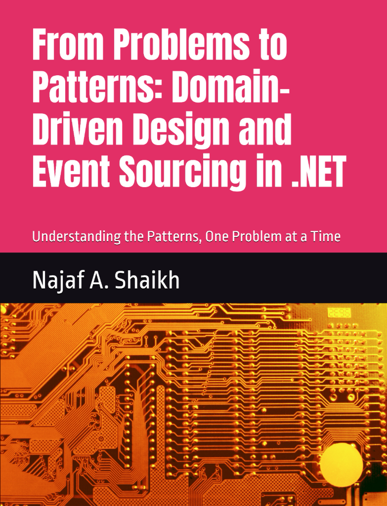

# Companion Code Repository

<a href="https://www.amazon.com/Problems-Patterns-Domain-Driven-Sourcing-Understanding-ebook/dp/B0GX32V9F1/">
  
</a>

**From Problems to Patterns — Domain-Driven Design and Event Sourcing in .NET**
*By Najaf Shaikh · First Edition, 2026*

---

## Overview

This directory contains the complete, runnable companion code for all 32 chapters of the book. Every code example from every chapter builds and all tests pass. The code evolves chapter by chapter through a single Bank Account domain — starting from a naive CRUD implementation and ending with a containerised, observable, event-sourced system built on [SourceFlow.Net](https://github.com/CodeShayk/SourceFlow.Net) v1.0.0.

---

## How to Open

### Single root solution (recommended)

Open `BankAccount.sln` in Visual Studio 2022 or Rider. All 28 projects from all 7 parts load in a single solution, organised into solution folders by Part.

```
BankAccount.sln
├── Part-I -- Thinking in Domains
│   ├── src/  BankAccount.Domain
│   └── tests/ BankAccount.Domain.Tests
├── Part-II -- Modelling with Events
│   ├── src/  BankAccount.Commands, BankAccount.Domain, BankAccount.Infrastructure
│   └── tests/ BankAccount.Tests
├── Part-III -- Commanding Change
│   ├── src/  BankAccount.Application, BankAccount.Domain, BankAccount.Infrastructure
│   └── tests/ BankAccount.Tests
├── Part-IV -- Reading the World
│   ├── src/  BankAccount.Api, BankAccount.Domain
│   └── tests/ BankAccount.Tests
├── Part-V -- Infrastructure and Persistence
│   ├── src/  BankAccount.Api, BankAccount.Domain, BankAccount.Infrastructure
│   └── tests/ BankAccount.Tests
├── Part-VI -- Production Readiness
│   ├── src/  BankAccount.Api, BankAccount.Domain, BankAccount.Infrastructure
│   └── tests/ BankAccount.Tests
└── Part-VII -- Inside the Framework
    ├── src/  BankAccount.Api, BankAccount.Domain, BankAccount.Infrastructure,
    │         BankAccount.Infrastructure.Audit, BankAccount.Infrastructure.Aws,
    │         BankAccount.Infrastructure.MongoDb
    └── tests/ BankAccount.Tests
```

### Per-part solutions

Each part also has its own self-contained solution if you want to focus on a single part:

```
Part-I/Part-I.sln
Part-II/Part-II.sln
...
Part-VII/Part-VII.sln
```

---

## Build and Test

```bash
# Build everything
dotnet build BankAccount.sln

# Run all 152 tests across all 7 parts
dotnet test BankAccount.sln

# Or test a single part
dotnet test Part-III/Part-III.sln
```

---

## Part-by-Part Guide

| Part | Chapters | Key Concepts | Projects |
|------|----------|-------------|---------|
| **I — Thinking in Domains** | 1–6 | CRUD problems, Ubiquitous Language, Bounded Contexts, Value Objects, Aggregates, Domain Events | `BankAccount.Domain` |
| **II — Modelling with Events** | 7–11 | Hand-built append-only command log, sequencing, EF Core persistence, replay, snapshots | `BankAccount.Domain`, `BankAccount.Commands`, `BankAccount.Infrastructure` |
| **III — Commanding Change** | 12–16 | SourceFlow.Net adoption, Commands, Command Pipeline, Sagas, multi-step Sagas, Compensation | `BankAccount.Application`, `BankAccount.Domain`, `BankAccount.Infrastructure` |
| **IV — Reading the World** | 17–22 | Event Pipeline, Read Models, Projections, Eventual Consistency, Validation, Projection Rebuild | `BankAccount.Api`, `BankAccount.Domain` |
| **V — Infrastructure & Persistence** | 23–26 | Three-store architecture, EF Core integration, Schema Evolution, full production stack | `BankAccount.Api`, `BankAccount.Domain`, `BankAccount.Infrastructure` |
| **VI — Production Readiness** | 27–29 | Polly resilience, OpenTelemetry tracing, Docker containerisation | `BankAccount.Api`, `BankAccount.Domain`, `BankAccount.Infrastructure` |
| **VII — Inside the Framework** | 30–32 | Framework internals, MongoDB custom store, AWS SQS cloud dispatch | `BankAccount.Api`, `BankAccount.Domain`, `BankAccount.Infrastructure`, `.Audit`, `.Aws`, `.MongoDb` |

---

## Prerequisites

- [.NET 9 SDK](https://dotnet.microsoft.com/download/dotnet/9)
- Visual Studio 2022 v17.8+ **or** JetBrains Rider **or** VS Code with C# Dev Kit

Parts III–VII reference **SourceFlow.Net** via a local project reference to `References/SourceFlow.Net`. No NuGet restore is needed for the framework — it is included in this repository.

Parts VI and VII include `Dockerfile` and `docker-compose.yml`. Docker Desktop is required only if you intend to run the containerised deployment examples from Chapters 29–32.

---

## Repository Layout

```
Code/
├── BankAccount.sln          ← Root solution — opens all 28 projects
├── Part-I/                  ← Chapters 1–6
├── Part-II/                 ← Chapters 7–11
├── Part-III/                ← Chapters 12–16
├── Part-IV/                 ← Chapters 17–22
├── Part-V/                  ← Chapters 23–26
├── Part-VI/                 ← Chapters 27–29  (includes Dockerfile)
└── Part-VII/                ← Chapters 30–32  (includes Dockerfile, MongoDB, AWS)
```

---

## SourceFlow.Net

The framework used throughout Parts III–VII is [SourceFlow.Net v1.0.0](https://github.com/CodeShayk/SourceFlow.Net), included as a NuGet package reference.

See **Appendix A** of the book for the full SourceFlow.Net API reference, and **Appendix D** for dev environment setup instructions.

---

*All code targets .NET 9. All tests use xUnit + FluentAssertions.*
